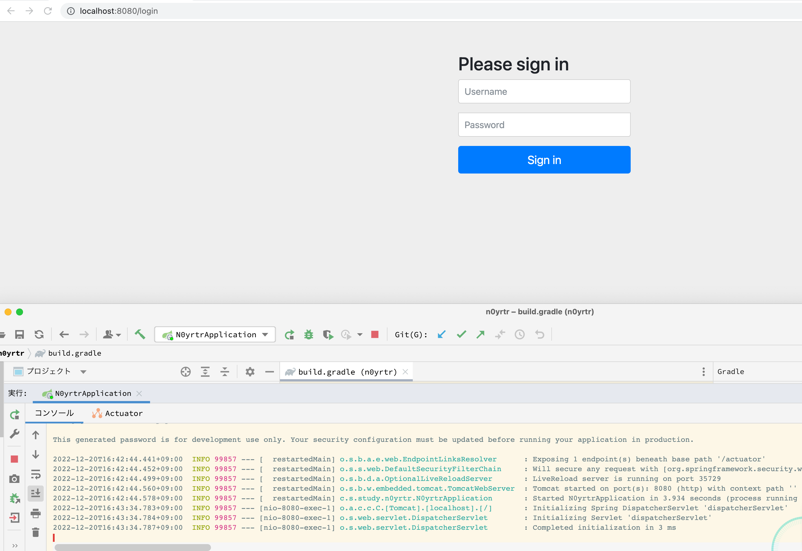

# 1.0.0

## やったこと
- 下記の設定値でSpirng Initirizrにてプロジェクトを作成 


- ビルドすると、thymeleaf-extras-spirngsecurity6:3.1.0.RELEASEが解決出来ないgradleエラーがでたので、:3.1.1.RELEASEを指定して解決。  
[参考](https://stackoverflow.com/questions/74603629/could-not-resolve-org-thymeleaf-extrasthymeleaf-extras-springsecurity63-1-0-r/74610296)  
理由はよくわかってないがbomの情報が古い？

- bootrunで無事起動(デフォルトのログインページが表示された)

  


## 疑問点
### 表示されたログインページはどこにある？
該当のHTMLを直接いじることは出来ないのか？とちょっと思った。

### ライブラリを入れるだけで、ログインページの表示まで行われるのはなぜか。
普通のライブラリは、入れても使わなければ意味がない。  
ただSpringSecurityは入れるだけで、ログインページの表示まで行われた。  
SpringStartar系のライブラリはSpringへの組込みまで行われるものと認識しているので、
そういうことなのだろうとは思うのだけど実際どういう仕組みなのかがわかっていない。
SpringStartarとしてのライブラリがどのようにして作られているかそこから調べてみたい。

### maven bom の仕組みをちゃんとわかっていないので、エラー解決はしたが、何が直されるとこの問題は発生しなくなるのかはわかっていない。
maven bomにて同じライブラリ群のバージョン合わせをしているが、 
今回のエラーはどうして起こっているのか？公式がbom登録の更新をしていないとかそういうなのか？  	

## 疑問点調査
### 表示されたログインページはどこにある？
```java
package org.springframework.security.web.authentication.ui;
```

```java
/**
 * For internal use with namespace configuration in the case where a user doesn't
 * configure a login page. The configuration code will insert this filter in the chain
 * instead.
 *
 * Will only work if a redirect is used to the login page.
 *
 * @author Luke Taylor
 * @since 2.0
 */
public class DefaultLoginPageGeneratingFilter extends GenericFilterBean {
```

︙

L191

```java
private String generateLoginPageHtml(HttpServletRequest request, boolean loginError, boolean logoutSuccess) {
   String errorMsg = "Invalid credentials";
   if (loginError) {
      HttpSession session = request.getSession(false);
      if (session != null) {
         AuthenticationException ex = (AuthenticationException) session
               .getAttribute(WebAttributes.AUTHENTICATION_EXCEPTION);
         errorMsg = (ex != null) ? ex.getMessage() : "Invalid credentials";
      }
   }
   String contextPath = request.getContextPath();
   StringBuilder sb = new StringBuilder();
   sb.append("<!DOCTYPE html>\n");
   sb.append("<html lang=\"en\">\n");
   sb.append("  <head>\n");
   sb.append("    <meta charset=\"utf-8\">\n");
   sb.append("    <meta name=\"viewport\" content=\"width=device-width, initial-scale=1, shrink-to-fit=no\">\n");
   sb.append("    <meta name=\"description\" content=\"\">\n");
   sb.append("    <meta name=\"author\" content=\"\">\n");
   sb.append("    <title>Please sign in</title>\n");
   sb.append("    <link href=\"https://maxcdn.bootstrapcdn.com/bootstrap/4.0.0-beta/css/bootstrap.min.css\" "
         + "rel=\"stylesheet\" integrity=\"sha384-/Y6pD6FV/Vv2HJnA6t+vslU6fwYXjCFtcEpHbNJ0lyAFsXTsjBbfaDjzALeQsN6M\" crossorigin=\"anonymous\">\n");
   sb.append("    <link href=\"https://getbootstrap.com/docs/4.0/examples/signin/signin.css\" "
         + "rel=\"stylesheet\" crossorigin=\"anonymous\"/>\n");
   sb.append("  </head>\n");
   sb.append("  <body>\n");
   sb.append("     <div class=\"container\">\n");
   if (this.formLoginEnabled) {
      sb.append("      <form class=\"form-signin\" method=\"post\" action=\"" + contextPath
            + this.authenticationUrl + "\">\n");
      sb.append("        <h2 class=\"form-signin-heading\">Please sign in</h2>\n");
      sb.append(createError(loginError, errorMsg) + createLogoutSuccess(logoutSuccess) + "        <p>\n");
      sb.append("          <label for=\"username\" class=\"sr-only\">Username</label>\n");
      sb.append("          <input type=\"text\" id=\"username\" name=\"" + this.usernameParameter
            + "\" class=\"form-control\" placeholder=\"Username\" required autofocus>\n");
      sb.append("        </p>\n");
      sb.append("        <p>\n");
```


### ライブラリを入れるだけで、ログインページの表示まで行われるのはなぜか。

とりあえずデフォルト実装があるはずなので、SpringSecurityの実装を見てみることにした。


 #### ログインページ表示

先程の、DefaultLoginPageGeneratingFilterは
```java
org.springframework.security.config.annotation.web.configurers.DefaultLoginPageConfigurer
```

によって使用されており、DefaultLoginPageConfigurerは以下のように使用されていた。

```java
package org.springframework.security.config.annotation.web.configuration;
```

︙

```java
/**
 * {@link Configuration} that exposes the {@link HttpSecurity} bean.
 *
 * @author Eleftheria Stein
 * @since 5.4
 */
@Configuration(proxyBeanMethods = false)
class HttpSecurityConfiguration {
```

```java
@Bean(HTTPSECURITY_BEAN_NAME)
@Scope("prototype")
HttpSecurity httpSecurity() throws Exception {
   LazyPasswordEncoder passwordEncoder = new LazyPasswordEncoder(this.context);
   AuthenticationManagerBuilder authenticationBuilder = new DefaultPasswordEncoderAuthenticationManagerBuilder(
         this.objectPostProcessor, passwordEncoder);
   authenticationBuilder.parentAuthenticationManager(authenticationManager());
   authenticationBuilder.authenticationEventPublisher(getAuthenticationEventPublisher());
   HttpSecurity http = new HttpSecurity(this.objectPostProcessor, authenticationBuilder, createSharedObjects());
   WebAsyncManagerIntegrationFilter webAsyncManagerIntegrationFilter = new WebAsyncManagerIntegrationFilter();
   webAsyncManagerIntegrationFilter.setSecurityContextHolderStrategy(this.securityContextHolderStrategy);
   // @formatter:off
   http
      .csrf(withDefaults())
      .addFilter(webAsyncManagerIntegrationFilter)
      .exceptionHandling(withDefaults())
      .headers(withDefaults())
      .sessionManagement(withDefaults())
      .securityContext(withDefaults())
      .requestCache(withDefaults())
      .anonymous(withDefaults())
      .servletApi(withDefaults())
      .apply(new DefaultLoginPageConfigurer<>());
   http.logout(withDefaults());
   // @formatter:on
   applyDefaultConfigurers(http);
   return http;
}
```
余談→[http.hogehoge(withDefaults())について](#withDefaults)


またこのBeanは以下のでautowiredされ、
さらにSecurityFilterChainがなければdefaultでformloginを設定しているところを発見
```java
@Autowired(required = false)
	private HttpSecurity httpSecurity;

	@Bean
	public static DelegatingApplicationListener delegatingApplicationListener() {
		return new DelegatingApplicationListener();
	}

	@Bean
	@DependsOn(AbstractSecurityWebApplicationInitializer.DEFAULT_FILTER_NAME)
	public SecurityExpressionHandler<FilterInvocation> webSecurityExpressionHandler() {
		return this.webSecurity.getExpressionHandler();
	}

	/**
	 * Creates the Spring Security Filter Chain
	 * @return the {@link Filter} that represents the security filter chain
	 * @throws Exception
	 */
	@Bean(name = AbstractSecurityWebApplicationInitializer.DEFAULT_FILTER_NAME)
	public Filter springSecurityFilterChain() throws Exception {
		boolean hasFilterChain = !this.securityFilterChains.isEmpty();
		if (!hasFilterChain) {
			this.webSecurity.addSecurityFilterChainBuilder(() -> {
				this.httpSecurity.authorizeHttpRequests((authorize) -> authorize.anyRequest().authenticated());
				this.httpSecurity.formLogin(Customizer.withDefaults());
				this.httpSecurity.httpBasic(Customizer.withDefaults());
				return this.httpSecurity.build();
			});
		}
		for (SecurityFilterChain securityFilterChain : this.securityFilterChains) {
			this.webSecurity.addSecurityFilterChainBuilder(() -> securityFilterChain);
		}
		for (WebSecurityCustomizer customizer : this.webSecurityCustomizers) {
			customizer.customize(this.webSecurity);
		}
		return this.webSecurity.build();
	}
```

5.4以降の話ではあるが、
SecurityFilterChainをBean定義できるようになったので、SecurityFilterChainのBeanを返す、メソッドの中でhttpの設定を記載して
うわがきをおこなうのはここに影響することがわかる。


#### http.hogehoge()以外でBean登録によって、カスタマイズするやつのdefaultは？
例えば、デフォルトでパスワードエンコーダーはBcryptEncoderなので
BcryptEncoderをデフォルトにしているような実装がないか探してみる。


PasswordEncoderParser L48
```java
private static final Map<String, Class<?>> ENCODER_CLASSES = Collections.singletonMap(OPT_HASH_BCRYPT,
			BCryptPasswordEncoder.class);
```
こんな処理を見つけた。  
sping-security-config になんとかParserというクラスが入っているが、  
~~こいつらが、Beanのparseをするものという意味っぽい？~~  
 →xml parser のparseっぽい。xmlconfigファイルからparseするという意味か？

sping-security-configがいろいろと初期設定をやっている感じがする。

PasswordEncoderParserの処理を使用しているところもparserでそこでParserの大元のinterfaceにたどり着いた(このファイルはspirng security の中ではなく
spring自体の org.springframework.beans.factoryにある。)
```java
package org.springframework.beans.factory.xml;

import org.w3c.dom.Element;

import org.springframework.beans.factory.config.BeanDefinition;
import org.springframework.lang.Nullable;
public interface BeanDefinitionParser {

	/**
	 * Parse the specified {@link Element} and register the resulting
	 * {@link BeanDefinition BeanDefinition(s)} with the
	 * {@link org.springframework.beans.factory.xml.ParserContext#getRegistry() BeanDefinitionRegistry}
	 * embedded in the supplied {@link ParserContext}.
	 * <p>Implementations must return the primary {@link BeanDefinition} that results
	 * from the parse if they will ever be used in a nested fashion (for example as
	 * an inner tag in a {@code <property/>} tag). Implementations may return
	 * {@code null} if they will <strong>not</strong> be used in a nested fashion.
	 * @param element the element that is to be parsed into one or more {@link BeanDefinition BeanDefinitions}
	 * @param parserContext the object encapsulating the current state of the parsing process;
	 * provides access to a {@link org.springframework.beans.factory.support.BeanDefinitionRegistry}
	 * @return the primary {@link BeanDefinition}
	 */
	@Nullable
	BeanDefinition parse(Element element, ParserContext parserContext);
}
```

ということは、
SpringStarter系ライブラリを自身でつくると考えたときに、
BeanDefinitionを返すParserクラスを作れば、デフォルトのBeanの決定をでき、
カスタマイズされたBeanがあればそれを優先させるということができるのではないかと考えた。


###  maven bom の仕組みをちゃんとわかっていないので、エラー解決はしたが、何が直されるとこの問題は発生しなくなるのかはわかっていない。


spring.security.bom という `spring-security-bom.gradle` 1ファイルだけ持っているpackageを発見

```groovy
import io.spring.gradle.convention.SpringModulePlugin

apply plugin: 'io.spring.convention.bom'

dependencies {
   constraints {
      project.rootProject.allprojects { p ->
         p.plugins.withType(SpringModulePlugin) {
            api p
         }
      }
   }
}
```

​	


## 余談
<a id="withDefaults"></a>
### http.hogehoge(withDefaults())について

```java
		http
      .csrf(withDefaults())
      .addFilter(webAsyncManagerIntegrationFilter)
      .exceptionHandling(withDefaults())
      .headers(withDefaults())
      .sessionManagement(withDefaults())
      .securityContext(withDefaults())
      .requestCache(withDefaults())
      .anonymous(withDefaults())
      .servletApi(withDefaults())
      .apply(new DefaultLoginPageConfigurer<>());
```


それぞれメソッドには受け取る引数に以下のCustomizerをimplementsしたものを引数としてうけとるよう作られている。

そのため、Customizerを引数にとっている場合はwithDefaultsと書けば、何もしないカスタマイザーが返却される。

```java
/**
 * Callback interface that accepts a single input argument and returns no result.
 *
 * @param <T> the type of the input to the operation
 * @author Eleftheria Stein
 * @since 5.2
 */
@FunctionalInterface
public interface Customizer<T> {

   /**
    * Performs the customizations on the input argument.
    * @param t the input argument
    */
   void customize(T t);

   /**
    * Returns a {@link Customizer} that does not alter the input argument.
    * @return a {@link Customizer} that does not alter the input argument.
    */
   static <T> Customizer<T> withDefaults() {
      return (t) -> {
      };
   }

}
```

例えばHttpSecurity.csrf()メソッドはこんな感じ

```java
public HttpSecurity csrf(Customizer<CsrfConfigurer<HttpSecurity>> csrfCustomizer) throws Exception {
		ApplicationContext context = getContext();
		csrfCustomizer.customize(getOrApply(new CsrfConfigurer<>(context)));
		return HttpSecurity.this;
	}
```

```java
/**
 * If the {@link SecurityConfigurer} has already been specified get the original,
 * otherwise apply the new {@link SecurityConfigurerAdapter}.
 * @param configurer the {@link SecurityConfigurer} to apply if one is not found for
 * this {@link SecurityConfigurer} class.
 * @return the current {@link SecurityConfigurer} for the configurer passed in
 * @throws Exception
 */
@SuppressWarnings("unchecked")
private <C extends SecurityConfigurerAdapter<DefaultSecurityFilterChain, HttpSecurity>> C getOrApply(C configurer)
      throws Exception {
   C existingConfig = (C) getConfigurer(configurer.getClass());
   if (existingConfig != null) {
      return existingConfig;
   }
   return apply(configurer);
}
```
